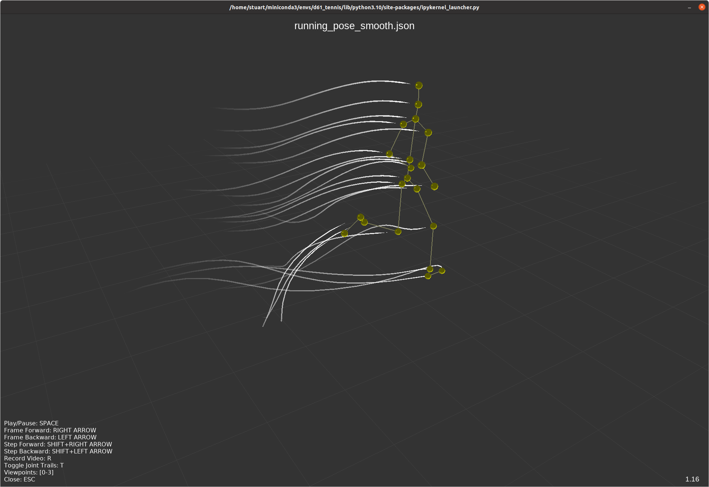

# 3D Pose Model Visualisation Tool

An OpenGL visualisation tool for 3D pose models.

## Description

This project is an OpenGL-based visualisation tool designed to render and display 3D pose models. The original pose models used in this project are trained using the [aspset-510 dataset](https://github.com/anibali/aspset-510).



## Requirements

To set up the required environment, run the following command:

```sh
conda env create -f environment.yml
```

## Usage

Open the ```pose_3D.ipynb``` by starting Jupyter Notebook:

```sh
# Run a Jupyter Notebook session
jupyter notebook
```

## Acknowledgements

This project makes use of the ASPset dataset. Please refer to the following publication for more details:

```text
@article{nibali2021aspset,
  title={{ASPset}: An Outdoor Sports Pose Video Dataset With {3D} Keypoint Annotations},
  author={Nibali, Aiden and Millward, Joshua and He, Zhen and Morgan, Stuart},
  journal={Image and Vision Computing},
  pages={104196},
  year={2021},
  issn={0262-8856},
  doi={https://doi.org/10.1016/j.imavis.2021.104196},
  url={https://www.sciencedirect.com/science/article/pii/S0262885621001013},
  publisher={Elsevier}
}
```

